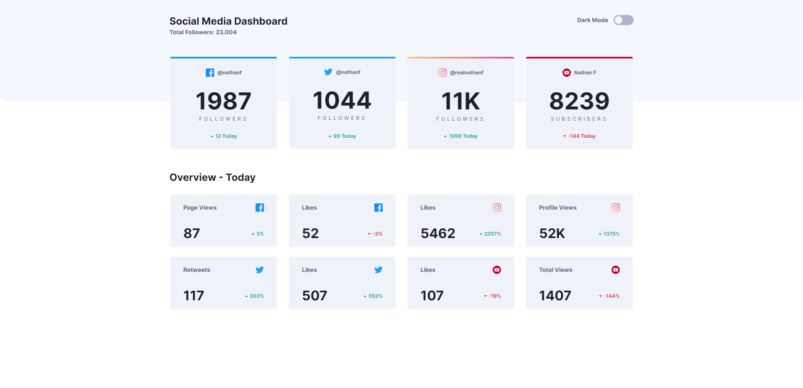
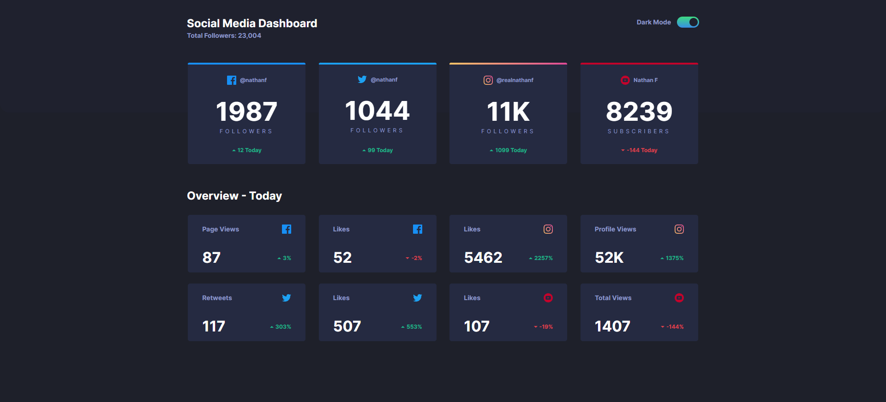

# Frontend Mentor - Social media dashboard with theme switcher solution

This is a solution to the [Social media dashboard with theme switcher challenge on Frontend Mentor](https://www.frontendmentor.io/challenges/social-media-dashboard-with-theme-switcher-6oY8ozp_H).

## Table of contents

- [Overview](#overview)
  - [The challenge](#the-challenge)
  - [Screenshot](#screenshot)
  - [Links](#links)
- [My process](#my-process)
  - [Built with](#built-with)
  - [What I learned](#what-i-learned)
  - [Continued development](#continued-development)
  - [Useful resources](#useful-resources)
- [Author](#author)

## Overview

This project has the purpose of offering a simplified analysis within a dashboard

### The challenge

Users should be able to:

- View the optimal layout for the site depending on their device's screen size
- See hover states for all interactive elements on the page
- Toggle color theme to their preference

### Screenshot




### Links

- Solution URL: [Social Media Dashboard](https://Alexandre-Akira.github.io/social_media_dashboard)

## My process

### Built with

- Semantic HTML5 markup
- CSS custom properties
- Flexbox
- CSS Grid
- Mobile-first workflow
- [React](https://reactjs.org/) - JS library

### What I learned

The diferent approaches to implement a dark theme.

- Body Class Approach

  Style things up as we normally would, at the end this will be the deafult mode, then create a complete set of color styles using a class set on the body element.

- Separate StyleSheets Approach
  Instead of having a single css file for dark and light mode, we will have 2 files, each one with their set of colors. The trick here is to toggle between stylesheets.

- Custom Properties Approach
  The trick here is to use css varibles. Imagine that we will have to style background color of the body element and toggle it between dark and light mode. So to accomplish it u will have to do the following:

```css
/* CSS variables declared */
body {
  --backgroundColor: #fff;
}
body.dark-theme {
  --backgroundColor: #000;
}

/* Styling our element */
body {
  background-color: var(--backgroundColor);
}
```

### Continued development

- Add a component chart, wich will render when the user clicks on a card.

### Useful resources

- [Dark and light mode](https://css-tricks.com/a-complete-guide-to-dark-mode-on-the-web/#aa-using-a-body-class) - This helped me to learn about diferent ways to implement a dark mode

## Author

- Github - [Alexandre-Akira](https://github.com/Alexandre-Akira)
- Frontend Mentor - [@Alexandre-Akira](https://www.frontendmentor.io/profile/Alexandre-Akira)
- Linkedin - [AlexandreAkira](https://www.linkedin.com/in/alexandreakira/)
